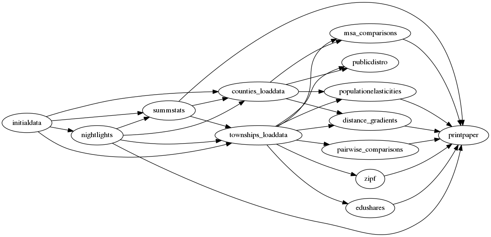

This repository contains the data and code underlying the paper "[Cities, Lights, and Skills in Developing Economies](http://faculty.chicagobooth.edu/jonathan.dingel/research/DingelMiscioDavis.pdf)" in the _Journal of Urban Economics_ by Jonathan Dingel, Antonio Miscio, and Don Davis.

We thank Dylan Clarke for excellent research assistance, epecially for doing the yeoman's work of implementing our algorithms in `R` after they were initially written in `ArcGIS`.

If you want to apply our algorithm in your own work (rather than replicate our paper), see the [lights_to_cities](https://github.com/jdingel/lights_to_cities) repository.

## Code organization

The repository contains four top-level directories, one for each country: `brazil`, `china`, `india`, and `usa`.

The workflow for each country is organized as a series of tasks.
For example, the `china` directory contains 16 folders that represent 16 tasks.
Each task folder contains three folders: `input`, `code`, `output`.
A task's output is used as an input by one or more downstream tasks.
[This graph](china/symlinks_graph/output/task_flow.png) depicts the input-output relationships between tasks for `china`.

We use Unix's [`make`](http://swcarpentry.github.io/make-novice/) utility to automate this workflow.
After downloading this replication package (and installing the relevant software), you can reproduce the figures and tables appearing in the paper simply by typing `make` at the command line.

## Software requirements
The project's tasks are implemented via [R](https://cran.r-project.org/) code, [Stata](http://www.stata.com) code, and shell scripts.
The taskflow structure employs [symbolic links](https://en.wikipedia.org/wiki/Symbolic_link).
To run the code, you must have installed R, Stata, and Bash.
We ran our code using R 3.5.1, Stata 15, and GNU bash version 4.2.46(2).
Our R code leverages spatial and measurement packages with additional system requirements, namely [`gdalUtils`](https://cran.r-project.org/web/packages/gdalUtils/index.html), [`rgdal`](https://cran.r-project.org/web/packages/rgdal/index.html), [`rgeos`](https://cran.r-project.org/web/packages/rgeos/index.html), [`sp`](https://cran.r-project.org/web/packages/units/index.html), [`sf`](https://cran.r-project.org/web/packages/sf/index.html), and [`units`](https://cran.r-project.org/web/packages/units/index.html).
We used [GEOS](https://trac.osgeo.org/geos/) 3.7.0, [GDAL](https://www.gdal.org/usergroup0.html) 2.3.2, [PROJ](https://proj4.org/download.html) 4.9, and [udunits](https://www.unidata.ucar.edu/software/udunits/udunits-current/doc/udunits/udunits2.html) 2.2.
We expect the code to work on other versions too.

## Replication instructions

### Download and run code

1. Download (or clone) this repository by clicking the green `Clone or download` button above.
Uncompress the ZIP file into a working directory on your cluster or local machine.
2. From the Unix/Linux/MacOSX command line, navigate to a country directory.
3. Typing `make` in a country directory will execute all the code.
	* If you are in a computing environment that supports the [Slurm workload manager](https://slurm.schedmd.com/) (if the `Makefile` detects that the command `sbatch` is valid), tasks will be submitted as jobs to your computing cluster.
	* If `sbatch` is not available, the `Makefile` will execute `Rscript` and `stata-se` commands locally.
	(Mac OS X users should [ensure](https://www.stata.com/support/faqs/mac/advanced-topics/) that `Rscript` and `stata-se` are in their relevant `PATH`.)

### Notes
- It is best to replicate the project using the `make` approach described above.
Nonetheless, it is also possible to produce the results task-by-task in the order depicted in the flow chart for each country.
These are available in the `symlinks_graph/output` folder for each country (e.g., [China](china/symlinks_graph/output/graphviz.txt)).
If all upstream tasks have been completed, you can complete a task by navigating to the task's `code` directory and typing `make`.
- An internet connection is required so that each country directory's `install_packages` task can install R packages and Stata programs.
- The Brazil case requires gigabytes of microdata that is available from the [IBGE](http://www.ibge.gov.br).
Read the `CENSO10_pes_dta_metadata.txt` file in the `initialdata` folder within the `brazil` directory.
You can skip this step by running `skip_microdata.sh` within the `brazil` directory.
